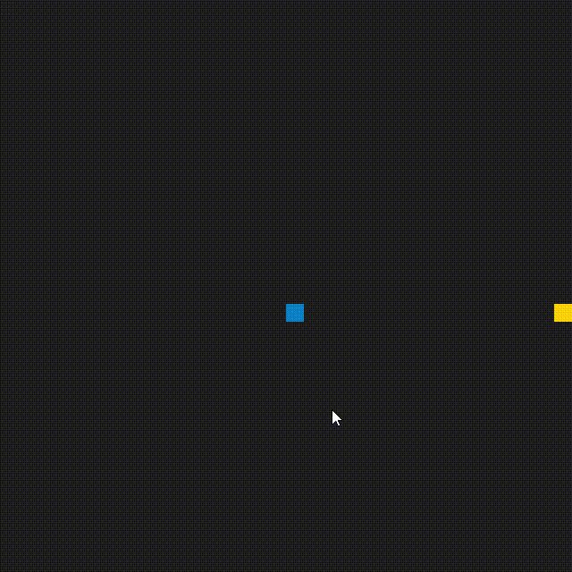

<h1 align="center">Welcome to Snake 👋</h1>
<p>
  <a href="LICENSE" target="_blank">
    
  </a>
  <a href="https://twitter.com/mbrsantana" target="_blank">
    
  </a>
</p>

> A simple snake game made in C++ and SDL 2



The code for this repo was inspired by [this](https://codereview.stackexchange.com/questions/212296/snake-game-in-c-with-sdl) excellent StackOverflow post and set of responses.

## Dependencies for Running Locally
* cmake >= 3.7
  * All OSes: [click here for installation instructions](https://cmake.org/install/)
* make >= 4.1 (Linux, Mac), 3.81 (Windows)
  * Linux: make is installed by default on most Linux distros
  * Mac: [install Xcode command line tools to get make](https://developer.apple.com/xcode/features/)
  * Windows: [Click here for installation instructions](http://gnuwin32.sourceforge.net/packages/make.htm)
* SDL2 >= 2.0
  * All installation instructions can be found [here](https://wiki.libsdl.org/Installation)
  * Note that for Linux, an `apt` or `apt-get` installation is preferred to building from source.
* gcc/g++ >= 5.4
  * Linux: gcc / g++ is installed by default on most Linux distros
  * Mac: same deal as make - [install Xcode command line tools](https://developer.apple.com/xcode/features/)
  * Windows: recommend using [MinGW](http://www.mingw.org/)

## Install
On the top level directory
```sh
mkdir build && cd build
cmake .. && make
```

## Usage

```sh
./SnakeGame
```

## Author

👤 **Marcos Santana**

* Twitter: [@mbrsantana](https://twitter.com/mbrsantana)
* Github: [@zerocoolbr](https://github.com/zerocoolbr)
* LinkedIn: [@marcosbrs](https://linkedin.com/in/marcosbrs)

## Show your support

Give a ⭐️ if this project helped you!

## 📝 License

Copyright © 2020 [Marcos Santana](https://github.com/zerocoolbr).<br />
This project is [MIT](LICENSE) licensed.